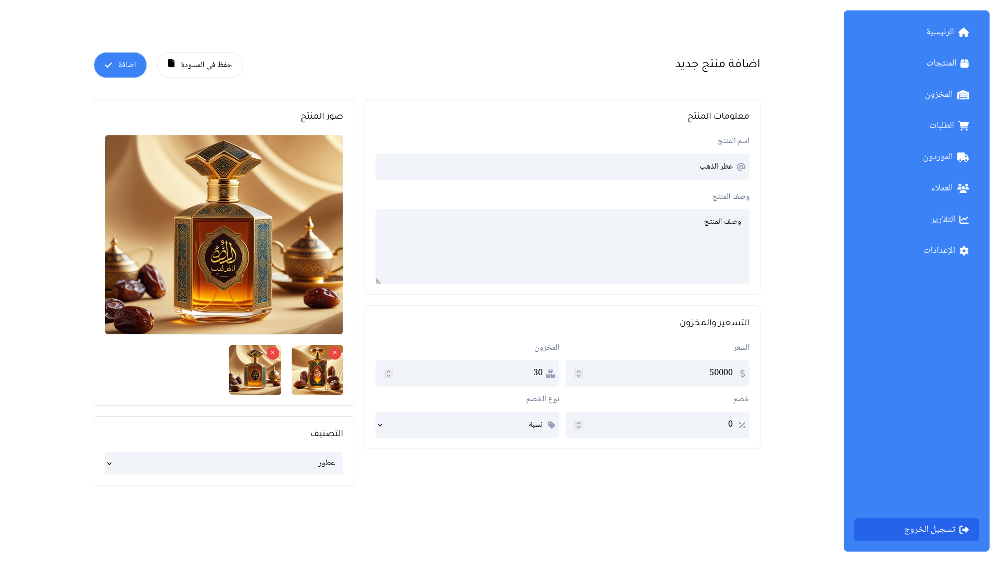

# نظام إدارة المخزون

## 📌 مقدمة
نظام إدارة المخزون هو تطبيق يساعد الشركات في تتبع وإدارة المخزون بكفاءة. يوفر النظام واجهة سهلة الاستخدام لإضافة المنتجات، إدارة المخزون، تتبع المبيعات، وإنشاء التقارير لمساعدة الشركات في تحسين عملياتها.

 

## ملاحظة مهمة 
الموقع لازال تحت التطوير والكثير من الميزات لا زالات غير متوفرة 

## 🎯 المميزات
- 📦 **إدارة المنتجات**: إضافة، تعديل، وحذف المنتجات.
- 📊 **إدارة المخزون**: تتبع الكميات المتاحة لكل منتج.
- 🛒 **إدارة المبيعات**: تسجيل عمليات البيع وتحديث المخزون تلقائيًا.
- 📢 **إشعارات التنبيه**: تنبيهات عند انخفاض مستوى المخزون.
- 📈 **تقارير وتحليلات**: إنشاء تقارير حول المبيعات، المخزون، والأرباح.
- 👥 **إدارة المستخدمين والصلاحيات**: تحديد صلاحيات الوصول لكل مستخدم.
- 🔄 **تكامل مع أنظمة الدفع والفواتير**.

## 🛠️ التقنيات المستخدمة
- **الواجهة الأمامية**: React.js / Next.js / Vue.js
- **الواجهة الخلفية**: Django / Flask / Node.js
- **قاعدة البيانات**: PostgreSQL / MySQL / MongoDB
- **التخزين السحابي**: AWS S3 / Firebase

## 🚀 طريقة التثبيت والتشغيل
```bash
# استنساخ المستودع
git clone https://github.com/husseinnaeemsec/inventory-management.git
cd inventory-management

# تثبيت المتطلبات
pip install -r requirements.txt  # للبايثون
npm install  # إذا كنت تستخدم Node.js

# تشغيل التطبيق
python manage.py runserver  # Django
npm run dev  # React/Vue
